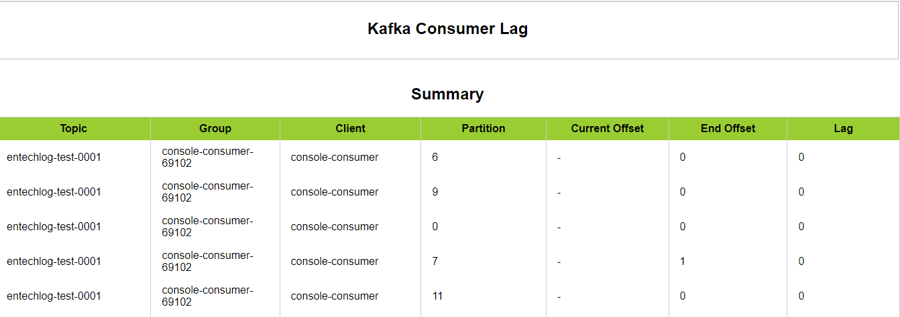

- [Kafka Simple Lag Checker](#kafka-simple-lag-checker)
  - [Prerequisite](#prerequisite)
  - [Overview](#overview)
    - [How to execute this script](#how-to-execute-this-script)
    - [Validating the results](#validating-the-results)
  - [Example](#example)

# Kafka Simple Lag Checker

## Prerequisite
- A machine with Linux based distribution
- This script also assumes the machine on which you are executing it has the network connection to the Kafka cluster

## Overview
This script uses [kafka-consumer-groups.sh](https://kafka.apache.org/documentation/#basic_ops_consumer_lag) to get the summary of lags in Kafka consumers

### How to execute this script
- cd to the directory which contains the script
- Execute the script by running the command `./simple-lag-checker.sh /tmp/kafka localhost:9094 /tmp/client.properties test-consumer`
- Here is the list of input variables used by this process
  | Input             | Description                                         |
  | ----------------- | --------------------------------------------------- |
  | kafka_home        | path in which kafka is installed                    |
  | bootstrap_servers | kafka host and port number in host:port format      |
  | command_config    | full path for command config file                   |
  | consumer_groups   | filter to fetch all consumers with matching pattern |

> Make sure the script has execute permission by running `chmod 0774 simple-lag-checker.sh`

### Validating the results
Script execution will generate html and csv report in `reports` subdirectory. Here is how a report would look like.



## Example

  ```bash
  ./simple-lag-checker.sh --kafka_home /kafka_2.13-3.1.0 --bootstrap_servers 192.168.0.101:31806 --command_config /kafka-utilities/simple-lag-checker/input/config/client.properties
  ```